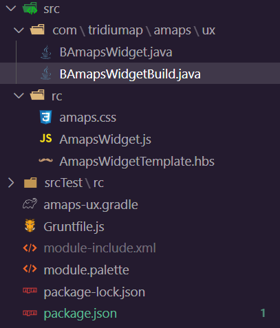

1. grunt-init init-niagara
   - https://github.com/tridium/grunt-init-niagara
2. add packages in package.json
   - "grunt": "~1.0.1",
   - "grunt-niagara": "^2.0.0-alpha.14",
   - "@babel/core": "^7.10.4",
   - "@babel/preset-env": "^7.10.4",
   - "babel-plugin-istanbul": "^4.1.3"
3. config `Gruntfile.js`

```
grunt.initConfig({
    ...
    babel: {
        options: {
            presets: ['@babel/preset-env'],
            plugins: [],
        },
        // r.js can't optimize if jsx syntax is present. so override the
        // grunt-niagara default behavior:
        // - jsx-only transpile into build/rjs (ES6 files)
        // - r.js optimize those (ES6 builtfile)
        // - the requirejs task will do a babel transpile from there (ES6->ES5 builtfile)
        // TODO maybe build this into grunt-niagara
        rjs: {
            options: {
            presets: [], // disable preset-env
            },
            files: [
            {
                expand: true,
                cwd: 'src/rc',
                src: ['*.js'],
                dest: 'build/rjs/src/rc',
            },
            {
                expand: true,
                cwd: 'srcTest/rc',
                src: ['*.js'],
                dest: 'build/rjs/srcTest/rc',
            },
            ],
        },
        coverage: {
            options: {
            plugins: ['istanbul'],
            },
        },
    },
})
```

4. config ux.gradle (bable can compile modern js to ES5)

```
dependencies {
  compile "Tridium:nre:4.7"
  compile "Tridium:baja:4.7"
  compile "Tridium:gx-wb:4.7"
  compile "Tridium:bajaui-wb:4.7"
  compile "Tridium:web-rt:4.7"
  compile "Tridium:js-ux:4.7"
  compile "Tridium:bajaux-rt:4.7"
  compile "Tridium:bajaux-ux:4.7"
}
...
gruntBuild { 
  tasks "babel:dist"
  tasks "babel:rjs"
  tasks "requirejs"
}
```

5. copy paste module.palette

6. gradle build

7. add Java class and builder
   - BAmapsWidget.java
   - BAmapsWidgetBuild.java

whole structure:

